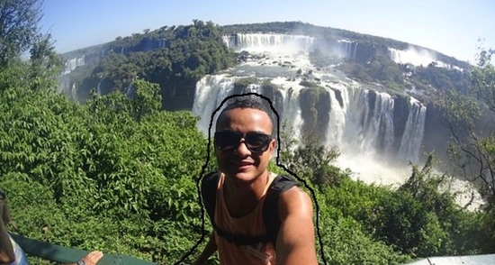
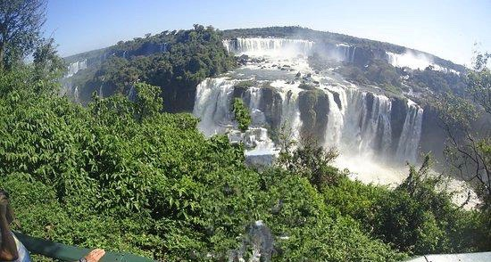

# Image Inpainting

## Description

Image inpainting makes it possible to erase elements present in an image and replace them with a plausible background, in particular by reproducing textures when the area to be filled is relatively large and by propagating linear structures such as contours.

This project has been coded in 2018 by [Jean Vassoyan](https://github.com/jvasso) and [Antoine Moulin](https://github.com/moulinantoine/) - students at Télécom Paris - under the supervision of [Alasdair Newson](https://sites.google.com/site/alasdairnewson/). It is based on the method described in [[1]](http://www.irisa.fr/vista/Papers/2004_ip_criminisi.pdf).

__Reference__
[1] Criminisi, Antonio and Pérez, Patrick and Toyama, Kentaro. _Region Filling and Object Removal by Exemplar-Based Image Inpainting_. In IEEE transactions on image processing : a publication of the IEEE Signal Processing Society, 2004.

## Getting started

__Step 1__: Install GIMP here [https://www.gimp.org/downloads/](https://www.gimp.org/downloads/). It is useful for the calls made in ``useful_functions.py``.

__Step 2__: Clone the repository.
* ``git clone https://github.com/moulinantoine/image-inpainting.git``
* ``cd image-inpainting``

__Step 3__: Install the environment.
* ``pip install virtualenv``
* ``virtualenv inpainting-env``
* ``source inpainting-env/bin/activate`` (Linux) or ``source inpainting-env/Scripts/activate`` (Windows)
* ``pip install -r requirements.txt``

__Step 4__: Launch the GUI. ``python -m GUI.py``.

## Use the GUI

There are two GUI files: <tt>GUI.py</tt> and <tt>GUI_for_tests.py</tt>. The first one makes it possible to make an inpainting on a single image by drawing a mask on it or loading it from your own directory. However, no data are recorded about this inpainting and you cannot compare statistical performance. The second one makes it possible to record data about an inpainting made on a whole dataset of images. However you cannot draw your own masks with, to work properly, it requires a file named "mask.jpg" in the folder of each image of the dataset.

In order to use ``GUI.py``: 
1. Click on Browse to search your image
2. Draw a mask on the image (or load one if it already exists)
3. Choose the parameters (if the number of clusters equals 1, the algorithm will use a restricted search area)
4. Choose the frequency of the display (in GIMP)
5. Click on Start inpainting

In order to use ``GUI_for_tests.py``:
1. Click on Browse to search the folder containing your data set
2. Select the parameter you want to change during the tests, and its range
3. Select the others parameters
4. Write a short description of the test
5. Click on Start the test 

## The class Files

There are 3 class files: ``image_inpainting.py``, ``pixel_inpainting.py``, ``test.py``.

  ``image_inpainting.py`` contains all the methods necessary to make an inpainting.
  ``pixel_inpainting.py`` representents a pixel in the image and is used by ``image_inpainting.py``.
  ``test.py`` is a class that representents a Test made on one image. It is used by the ``GUI_for_tests.py`` file.

## The dataset directory

The "dataset" directory is used by the <tt>GUI_for_tests.py</tt> file. It contains a set of folders which are called "data1", "data2", "data3" etc. In each data folder, you can find a file called "image.jpg", another one called "mask.jpg" and a directory called "tests" which contains python objects from the <tt>Test.py</tt> class. (Those objects were saved thanks to the module pickle)
It is very important to follow this rule about the names of image and mask in data directories. Otherwise the program cannot find them.

## The other files

<tt>useful_functions.py</tt> : it contains two "viewimage" functions which call GIMP with specific commands. Please check that these commands are adapted to your laptop before running the program.  

<tt>Inspect_Data.py</tt> : it contains a few functions to explore the data genarated with the tests made with <tt>GUI_for_test.py</tt>

## An example

Here is an example of inpainting obtained using our GUI:

__NB__:

- if you want to do an inpainting without using any optimization method you can just chose method number 1 (clustering on pixels) with a number of clusters equal to 1
